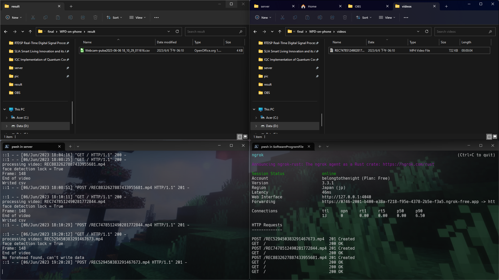

# WPD-on-phone
 
This repo is based on [thearn/webcam-pulse-detector](https://github.com/thearn/webcam-pulse-detector/tree/no_openmdao).

## Structure

1. ```./convertHRV```: User BPM to perform HRV analysis.
2. ```./pic```: Pictures.
3. ```./processVideo```: BPM extracting script.
4. ```./release```: Released software.
5. ```./server```: Server to receive videos for BPM extraction.
6. ```./result```: Extracted BPM data.
7. ```./videos```: Videos for BPM extraction.
8. ```./wpd_on_phone```: App to record and send video.

## Android Demo



## Links

1. [Learn The Dart Programming Language - Complete Free Course!](https://www.youtube.com/watch?v=JZukfxvc7Mc)
2. [How to setup Flutter, Visual Studio Code, and Android Emulator on Windows - 2022](https://www.youtube.com/watch?v=ZSWfgxrxN0M)
3. [Flutter Basic Training - 12 Minute Bootcamp](https://www.youtube.com/watch?v=1xipg02Wu8s)
4. [Flutter in 100 seconds](https://youtu.be/lHhRhPV--G0)
5. [OpenCV Cascade Classifier](https://docs.opencv.org/3.4/db/d28/tutorial_cascade_classifier.html)
6. [Computer Vision with ML Kit - Flutter In Focus](https://www.youtube.com/watch?v=ymyYUCrJnxU)
7. [Capture photos from Camera using Image Stream with Flutter](https://medium.com/@hugand/capture-photos-from-camera-using-image-stream-with-flutter-e9af94bc2bee)

